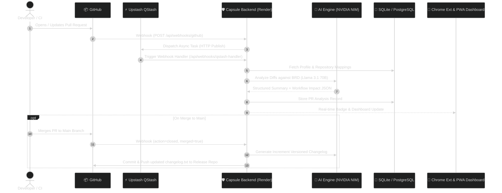
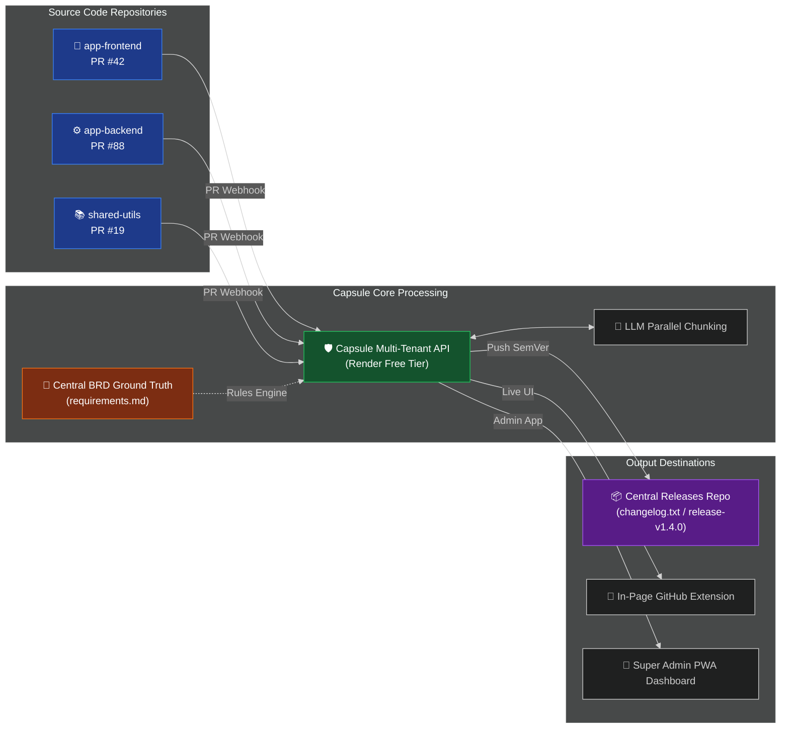
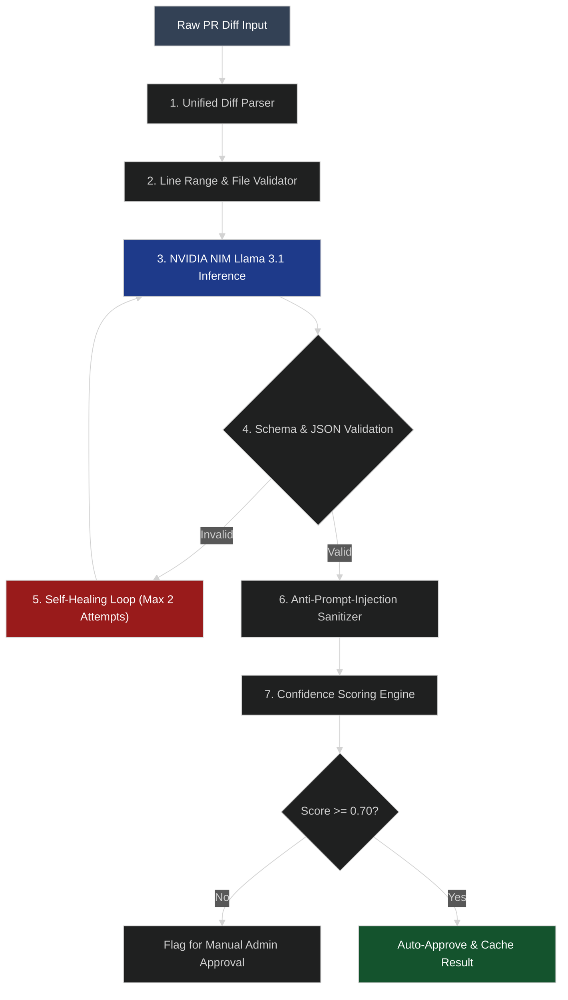

# Capsule 🛡️ — AI-Powered PR Analyzer & Automated Changelog Engine

[](https://www.python.org/)
[](https://fastapi.tiangolo.com/)
[](https://www.docker.com/)
[](https://capsule-backend-d1fp.onrender.com/admin)
[](LICENSE)
[](https://render.com/deploy?repo=https://github.com/PTejasKr/CApsule-v2)

> **"Why did we build this?"**  
> As engineers, we were tired of three things: spending hours writing release notes before every deploy, catching breaking architectural changes at 11 PM on a Friday, and trying to figure out which PR broke a business requirement written six months ago.  
>  
> **Capsule** solves this. It sits silently in your CI/CD pipeline and browser. Whenever a Pull Request is opened, Capsule reads the code diff, checks it against your actual **Business Requirement Document (BRD)**, warns you if critical workflows are at risk, and automatically writes & publishes versioned release notes when you merge.

---

## 🌐 Live Deployments & Quick Links

| Service / Tool | URL | Description |
| :--- | :--- | :--- |
| 👑 **Super Admin Dashboard (PWA)** | [capsule-backend-d1fp.onrender.com/admin](https://capsule-backend-d1fp.onrender.com/admin) | Full PWA web app — installable on mobile & desktop |
| 🚀 **Render API Server** | [capsule-backend-d1fp.onrender.com](https://capsule-backend-d1fp.onrender.com) | Live backend API (FastAPI + Upstash QStash) |
| 🌐 **Vercel Serverless Endpoint** | [capsule-opal-nine.vercel.app](https://capsule-opal-nine.vercel.app) | Backup serverless API function |
| 📦 **GitHub Repository** | [github.com/PTejasKr/CApsule-v2](https://github.com/PTejasKr/CApsule-v2) | Source code, blueprints, and releases |
| ⚓ **GitHub Webhook Endpoint** | `https://capsule-backend-d1fp.onrender.com/api/webhooks/github` | Webhook target for GitHub PR events |
| ⚙️ **Jenkins Webhook Endpoint** | `https://capsule-backend-d1fp.onrender.com/api/webhooks/jenkins` | API target for Jenkins CI/CD jobs |

---

## 💡 How Capsule Works (In Plain English)

```
1. You open a PR on GitHub ──> 2. Webhook triggers QStash ──> 3. Capsule reads your BRD rules
                                                                           │
                                                                           ▼
6. Auto-versions release  <── 5. Injects UI in GitHub & PWA <── 4. AI analyzes code diffs & risks
   & updates changelog.txt
```

1. **You open a PR**: GitHub sends a lightweight webhook payload to Capsule.
2. **Serverless Queue (Zero-Cost)**: Upstash QStash enqueues the job instantly to avoid hanging webhooks.
3. **BRD Compliance Check**: Capsule loads your business requirements (`requirements.md`) as the ground truth.
4. **AI Risk Analysis**: NVIDIA NIM (Llama 3.1 70B) reads the diff chunk-by-chunk to spot broken workflows, missing validations, or risky side effects.
5. **Interactive UI**: The **Chrome Extension** injects a risk badge directly into GitHub, while the **Super Admin PWA** gives your team a central dashboard.
6. **Automatic SemVer Changelog**: When merged to `main`, Capsule increments `vMAJOR.MINOR.PATCH` and commits formatted release notes to your release repo.

---

## 📐 Architecture & Visual Workflows

### 1. End-to-End System Event Architecture



---

### 2. Multi-Repo Orchestration Architecture

Capsule allows you to monitor multiple microservices (`frontend`, `backend`, `shared-lib`) and aggregate all changelogs into a single release branch.



---

### 3. Anti-Hallucination & Self-Healing Loop

To ensure AI doesn't invent non-existent file changes or hallucinate breaking risks, Capsule runs an 8-layer verification pipeline:



---

## 🗄️ Database Schemas & Data Models

Capsule uses an asynchronous database layer (`sqlite+aiosqlite` for local dev / `asyncpg` for PostgreSQL in production). Here are the exact database tables:

### 1. `pr_analyses` Table
Stores AI analysis results, risk scores, and workflow impact evaluations for every pull request.

| Column | Type | Constraints | Description |
| :--- | :--- | :--- | :--- |
| `id` | `INTEGER` / `SERIAL` | `PRIMARY KEY` | Unique analysis record ID |
| `pr_number` | `INTEGER` | `NOT NULL` | GitHub Pull Request number |
| `repo` | `VARCHAR(255)` | `NOT NULL` | Repository name (`owner/repo`) |
| `title` | `TEXT` | `NOT NULL` | Pull Request title |
| `summary` | `TEXT` | `NOT NULL` | Plain-English summary generated by AI |
| `changes_json` | `TEXT` / `JSONB` | `NOT NULL` | Array of modified files, line ranges, and change types |
| `workflow_impact_json` | `TEXT` / `JSONB` | `NOT NULL` | Affected workflows, severity (`MAJOR`, `MINOR`, `NONE`), before/after state |
| `confidence_score` | `FLOAT` | `DEFAULT 1.0` | AI verification confidence score (0.0 to 1.0) |
| `created_at` | `TIMESTAMP` | `DEFAULT CURRENT_TIMESTAMP` | Analysis creation timestamp |

### 2. `profiles` Table
Manages organization settings, API credentials, and default LLM engine configurations.

| Column | Type | Constraints | Description |
| :--- | :--- | :--- | :--- |
| `id` | `INTEGER` / `SERIAL` | `PRIMARY KEY` | Profile ID |
| `name` | `VARCHAR(100)` | `NOT NULL` | Profile / Team Name |
| `github_token` | `TEXT` | `NOT NULL` | GitHub Personal Access Token (encrypted/stored) |
| `changelog_repo` | `VARCHAR(255)` | `NOT NULL` | Target repository where `changelog.txt` is pushed |
| `ai_provider` | `VARCHAR(50)` | `DEFAULT 'nvidia'` | AI Provider (`nvidia`, `gemini`, `groq`, `ollama`) |
| `created_at` | `TIMESTAMP` | `DEFAULT CURRENT_TIMESTAMP` | Profile creation timestamp |

### 3. `repository_mappings` Table
Maps source GitHub repositories to specific Capsule profiles and custom BRD files.

| Column | Type | Constraints | Description |
| :--- | :--- | :--- | :--- |
| `id` | `INTEGER` / `SERIAL` | `PRIMARY KEY` | Mapping ID |
| `profile_id` | `INTEGER` | `FOREIGN KEY` | References `profiles(id)` |
| `source_repo` | `VARCHAR(255)` | `NOT NULL, UNIQUE` | Source GitHub repository (`owner/repo`) |
| `brd_path` | `TEXT` | `DEFAULT './brd/requirements.md'` | Path or reference to business rules document |

---

## 🛠️ API Endpoint Reference Map

| Method | Endpoint | Access | Purpose |
| :--- | :--- | :--- | :--- |
| `GET` | `/` | Public | System status and service health check |
| `GET` | `/admin` | Public | **Super Admin Dashboard (PWA)** web app |
| `POST` | `/api/webhooks/github` | HMAC Verified | Primary GitHub PR webhook listener |
| `POST` | `/api/webhooks/qstash-handler` | QStash Signed | Async task execution queue listener |
| `POST` | `/api/webhooks/jenkins` | `X-API-Key` | Explicit trigger endpoint for Jenkins CI/CD pipelines |
| `GET` | `/api/pr/{pr_number}` | `X-API-Key` | Retrieve stored analysis for a specific PR |
| `POST` | `/api/pr/{pr_number}/repair` | `X-API-Key` | Trigger self-healing AI repair loop on a PR summary |
| `POST` | `/api/pr/{pr_number}/approve` | `X-API-Key` | Admin approval for PR analysis and manual changelog push |
| `GET` | `/api/profiles` | `X-API-Key` | List all configured profiles and repository mappings |
| `POST` | `/api/auth/github/callback` | Public | GitHub OAuth authentication flow |

---

## ⚙️ Environment Variables Reference (`.env`)

| Variable | Required? | Default | Description |
| :--- | :--- | :--- | :--- |
| `API_KEY` | **Yes** | — | Master API Key for Extension, PWA, and Jenkins auth |
| `GITHUB_TOKEN` | **Yes** | — | GitHub Personal Access Token with `repo` and `webhook` scope |
| `GITHUB_WEBHOOK_SECRET` | **Yes** | — | Secret string for HMAC SHA-256 webhook validation |
| `CHANGELOG_REPO` | **Yes** | — | Target repository (`owner/repo`) for changelog commits |
| `NVIDIA_NIM_API_KEY` | **Yes** | — | NVIDIA NIM LLM API key (`nvapi-...`) |
| `NVIDIA_NIM_MODEL` | No | `meta/llama-3.1-70b-instruct` | LLM model name |
| `QSTASH_URL` | No | `https://qstash-us-east-1.upstash.io` | Upstash QStash URL |
| `QSTASH_TOKEN` | No | — | Upstash QStash Token for async queueing |
| `UPSTASH_REDIS_REST_URL` | No | `https://rational-buck-119535.upstash.io` | Upstash Redis REST URL |
| `UPSTASH_REDIS_REST_TOKEN` | No | — | Upstash Redis REST Token |
| `DATABASE_URL` | No | `sqlite+aiosqlite:///./data/capsule.db` | Async database connection URL |
| `LOG_LEVEL` | No | `INFO` | Logging level (`DEBUG`, `INFO`, `WARNING`, `ERROR`) |

---

## ⚡ Quick Setup Guide

### Option A: 1-Click Cloud Deployment (Render)

Click the button below to deploy your own free-tier instance on Render:

[](https://render.com/deploy?repo=https://github.com/PTejasKr/CApsule-v2)

*Render will automatically detect `render.yaml`, set up Python 3.12, install dependencies, and prompt for your `.env` secrets.*

---

### Option B: Local Setup (Docker or Python)

```bash
# 1. Clone the repository
git clone https://github.com/PTejasKr/CApsule-v2.git
cd CApsule-v2

# 2. Copy the example environment file
cp .env.example .env

# 3. Fill in your API_KEY, GITHUB_TOKEN, and NVIDIA_NIM_API_KEY in .env

# 4. Start via Docker Compose
docker-compose up -d --build

# Or run directly with Python:
python -m venv .venv
source .venv/bin/activate  # On Windows: .venv\Scripts\activate
pip install -r backend/requirements.txt
uvicorn backend.main:app --reload --port 8000
```

---

### Option C: Chrome Extension & PWA Installation

1. Open Chrome and navigate to `chrome://extensions`.
2. Enable **Developer mode** (top right).
3. Click **Load unpacked** and select the `extension/` folder in this repo.
4. Click the Capsule toolbar icon ➔ **Settings** ➔ Enter your Backend URL (`https://capsule-backend-d1fp.onrender.com` or `http://localhost:8000`) and your `API_KEY`.
5. **PWA Mobile/Desktop**: Open `https://capsule-backend-d1fp.onrender.com/admin` in any browser and click *"Add to Home Screen"* / *"Install Capsule"*.

---

### Option D: Jenkins CI/CD Setup

1. Copy [`jenkins/Jenkinsfile`](file:///c:/Users/punya/OneDrive/Desktop/capsulev2/capsule/jenkins/Jenkinsfile) to your project root.
2. In Jenkins, install **Generic Webhook Trigger Plugin** and **HTTP Request Plugin**.
3. Add a Global Credential named `capsule-api-key` containing your `API_KEY`.
4. Point your Jenkins Pipeline job to your repo. Capsule will analyze every PR build and publish versioned release notes on merge!

---

## 👥 Contributing & License

Contributions, feature requests, and bug reports are welcome!  
Distributed under the **MIT License**. See `LICENSE` for details.
